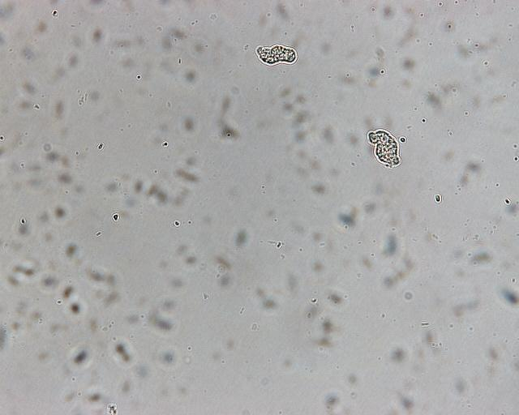
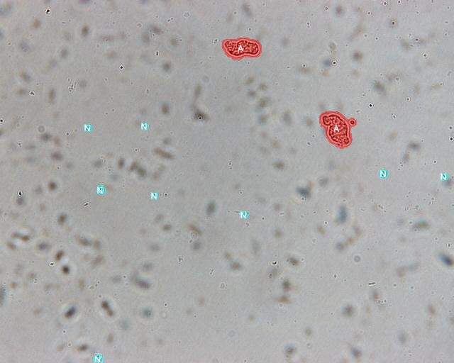

# Amoeba Segmentation Morphology

Image processing pipeline for amoeba segmentation in microscopy images. The project combines morphological filters, frequency-domain filtering, island-based watershed separation, and a second object-level classification stage with a Hybrid LVQ model.

## Preview

| Original image | Processed image |
| --- | --- |
|  |  |

## Context

This repository is prepared for publication on GitHub as supporting material for the SOMIB conference. The code and examples document the workflow used for amoeba segmentation in microscopy images.

The microscopy images used in this project were acquired at ESM, in the postgraduate Laboratory of Immunology of Infectious Diseases. The full image dataset is not distributed through this repository while sharing permissions are being confirmed; this note will be updated once the corresponding authorization is defined.

## Method Overview

The first stage builds candidate amoeba regions through frequency-domain filtering, morphological processing, local entropy analysis, adaptive filtering, and island-based watershed separation. The second stage uses an in-house Hybrid LVQ model developed by the authors as an improvement over LVQ2 for object-level classification.

## Contents

- `Metodo_SOMIB.py`: main segmentation pipeline, adaptive filters, image diagnostics, candidate mask generation, and watershed separation.
- `Segmentacion_con_filtro.py`: training utilities, object-level feature extraction, Hybrid LVQ, and second-stage classifier application.
- `etiquetar_regiones_carpeta.py`: interactive interface for labeling candidate regions as `amoeba` or `non_amoeba`.
- `example_usage.py`: minimal runnable example that segments a sample image and saves output images.
- `images1/`: sample input images.
- `processed_images/`: sample processed outputs.
- `modelo_hlvq_SOMIB.pkl`: trained model included as a reference for the experiments prepared for SOMIB.

## Requirements

- Python 3.10 or newer is recommended.
- Linux, macOS, or Windows with graphical window support if the interactive labeling tool will be used.
- Dependencies listed in `requirements.txt`.

Suggested installation:

```bash
python -m venv .venv
source .venv/bin/activate
pip install -r requirements.txt
```

On Windows:

```bash
python -m venv .venv
.venv\Scripts\activate
pip install -r requirements.txt
```

## Quick Start

Run the minimal example:

```bash
python example_usage.py
```

By default, the script uses `images1/amoeba_0001.jpg` and writes results to `example_outputs/`.

### 1. Segment an image from Python

```python
import cv2
from Metodo_SOMIB import segmentar_ameba_completa

img_bgr = cv2.imread("images1/amoeba_0001.jpg")
img_rgb = cv2.cvtColor(img_bgr, cv2.COLOR_BGR2RGB)

mask_bin, labels_ws, processed_img = segmentar_ameba_completa(img_rgb=img_rgb)
```

`mask_bin` contains the candidate binary mask, `labels_ws` contains the objects separated by watershed, and `processed_img` contains the filtered grayscale image used by the pipeline.

### 2. Label regions from a folder

```bash
python etiquetar_regiones_carpeta.py images1 etiquetas_regiones_SOMIB.pkl
```

Interactive window controls:

- `1`: amoeba mode.
- `0`: non-amoeba mode.
- left click: label the selected region.
- `u`: undo the last click.
- `c`: clear labels for the current image.
- `g`: save all labels and close.

### 3. Load labels and prepare a dataset

```python
from etiquetar_regiones_carpeta import cargar_etiquetas, preparar_dataset_segunda_red

data = cargar_etiquetas("etiquetas_regiones_SOMIB.pkl")
dataset = preparar_dataset_segunda_red(data, carpeta="images1", val_frac=0.25, seed=0)
```

### 4. Apply a trained second-stage object classifier

```python
import cv2
from Metodo_SOMIB import segmentar_ameba_completa
from Segmentacion_con_filtro import aplicar_segunda_red_por_objeto

img_bgr = cv2.imread("images1/amoeba_0001.jpg")
img_rgb = cv2.cvtColor(img_bgr, cv2.COLOR_BGR2RGB)

candidate_mask, _, _ = segmentar_ameba_completa(img_rgb=img_rgb)
final_mask, labels, predictions = aplicar_segunda_red_por_objeto(
    img_rgb,
    candidate_mask,
    ruta_pkl="modelo_hlvq_SOMIB.pkl",
)
```

## Recommended Workflow

1. Place microscopy images in a local folder.
2. Run `segmentar_ameba_completa` to generate candidate regions.
3. Use `etiquetar_regiones_carpeta.py` to create a `.pkl` label file.
4. Prepare the dataset with `preparar_dataset_segunda_red`.
5. Train or tune the second-stage classifier with the functions in `Segmentacion_con_filtro.py`.
6. Validate results visually and save examples in `processed_images/`.

## Repository Structure

```text
.
|-- Metodo_SOMIB.py
|-- Segmentacion_con_filtro.py
|-- etiquetar_regiones_carpeta.py
|-- example_usage.py
|-- images1/
|-- processed_images/
|-- modelo_hlvq_SOMIB.pkl
|-- requirements.txt
|-- LICENSE
`-- README.md
```

## Notes

- The scripts use `matplotlib` with the Qt backend for interactive visualization; on headless servers, you may need to change the backend or run only the non-interactive parts.
- Generated annotation files (`etiquetas_regiones*.pkl`) are treated as local outputs and should not be versioned unless they are part of the final dataset.
- `processed_images/` contains useful examples for documenting results, but new outputs can be regenerated from `images1/` and the scripts.
- A citation section will be added after the article is submitted or accepted.

## License

This project is released under the MIT License. See [LICENSE](LICENSE) for details.
